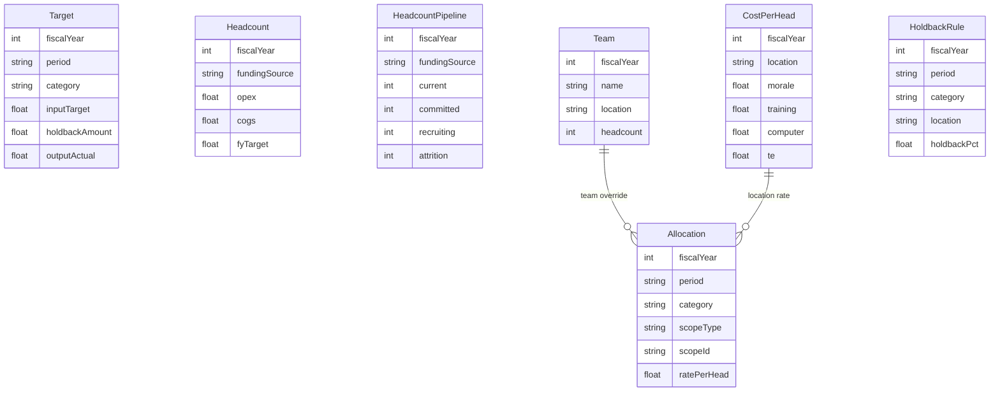

# Data model

```mermaid
erDiagram
  Target { int fiscalYear string period string category float inputTarget float holdbackAmount float outputActual }
  Headcount { int fiscalYear string fundingSource float opex float cogs float fyTarget }
  HeadcountPipeline { int fiscalYear string fundingSource int current int committed int recruiting int attrition }
  CostPerHead { int fiscalYear string location float morale float training float computer float te }
  Team { int fiscalYear string name string location int headcount }
  Allocation { int fiscalYear string period string category string scopeType string scopeId float ratePerHead }
  HoldbackRule { int fiscalYear string period string category string location float holdbackPct }
  Team ||--o{ Allocation : "team override"
  CostPerHead ||--o{ Allocation : "location rate"
```

See `snippets/01-schema/schema.prisma` for the full definitions and unique keys.
